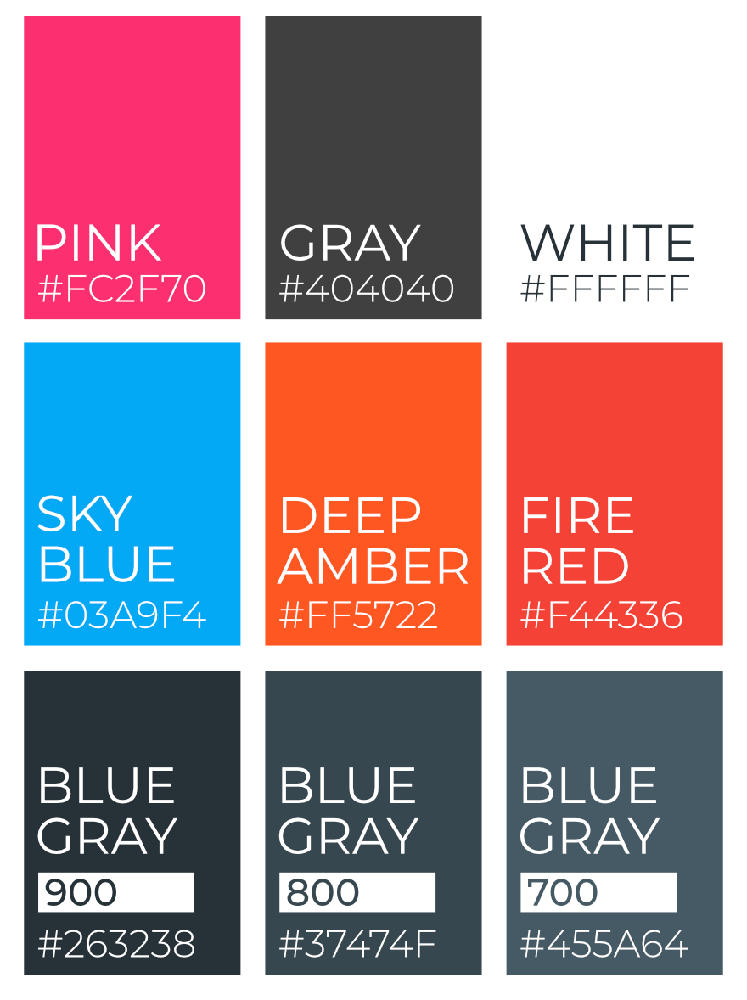

# MYRUNES.COM CORPORATE DESIGN

## Copyright and Licence

Logos and Icons are created and designed by [**@luxtracon**](https://twitter.com/luxtracon) and covered by the [Creative Commons Attribution Share Alike 4.0 International Licence](LICENCE).

## Logos and Icons

## Fonts

[**Montserrat**](https://fonts.google.com/specimen/Montserrat) is used as font for the logo, headlines and input placeholders on myrunes.com. The logo and headlines are represented in ALL UPPERCASE.

[**Roboto**](https://fonts.google.com/specimen/Roboto) is used as default general purpose font on myrunes.com and should not be used in any logos and icons.

## Color Palette

Below, you can find all colors which are generally used in the myrunes logos and icons as well as on the myrunes.com web page.

---

© 2019 MYRUNES.COM  
Covered by the CC-BY-SA-4.0 Licence.